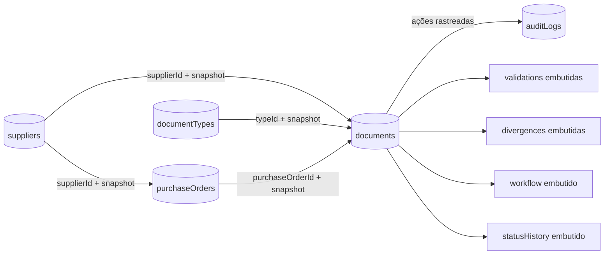

# Modelo lógico documental

## Decisões de modelagem

- Referências por `ObjectId` preservam o vínculo entre coleções compartilhadas.
- Snapshots guardam o estado histórico de fornecedor, tipo e pedido no momento do recebimento.
- Validações, divergências, workflow e histórico ficam embutidos no documento porque são consultados em conjunto.
- `metadata` armazena campos variáveis definidos por cada tipo documental.
